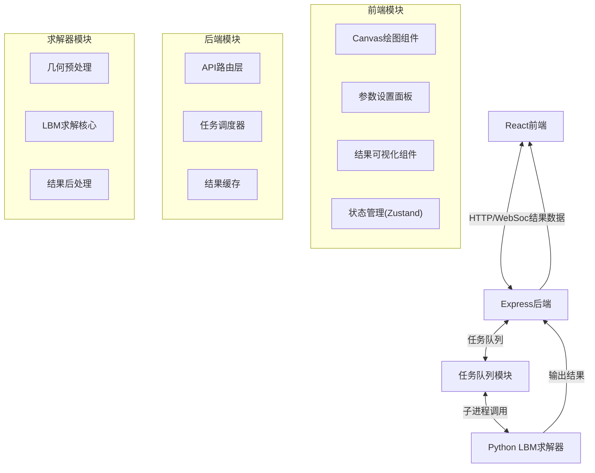
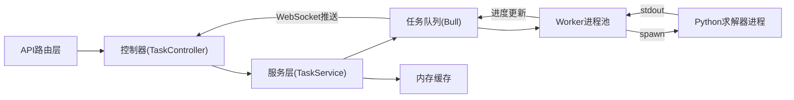
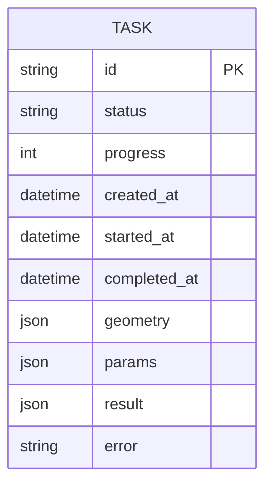

## 1. 架构设计



## 2. 技术描述

- **前端**：React@18 + TypeScript + Vite + TailwindCSS@3 + Zustand + Lucide React
- **后端**：Express@4 + TypeScript + Bull(任务队列)
- **求解器**：Python 3.9+ + NumPy（格子Boltzmann方法自定义求解器）
- **数据通信**：RESTful API + WebSocket（实时进度推送）
- **初始化工具**：vite-init 使用 react-express-ts 模板

## 3. 路由定义

| Route | Purpose |
|-------|---------|
| / | 主页面（绘图+参数+结果展示） |
| /api/tasks | POST提交计算任务，GET获取任务列表 |
| /api/tasks/:id | GET获取任务详情/结果 |
| /ws | WebSocket连接，实时推送任务进度 |

## 4. API定义

### TypeScript 类型定义

```typescript
// 几何数据类型
interface Point {
  x: number;
  y: number;
}

interface Room {
  points: Point[];        // 多边形顶点
  width: number;          // 实际宽度 (m)
  height: number;         // 实际高度 (m)
}

interface Vent {
  id: string;
  type: 'supply' | 'return';
  position: Point;        // 画布坐标
  normal: Point;          // 法向方向
  width: number;          // 风口宽度 (m)
  velocity: number;       // 风速 (m/s)
}

interface Geometry {
  room: Room;
  vents: Vent[];
  gridSize: number;       // 网格分辨率
}

// 求解参数
interface SolverParams {
  inletVelocity: number;  // 送风速度 (m/s)
  outletPressure: number; // 回风压力 (Pa)
  kinematicViscosity: number;  // 运动粘度 (m²/s)
  timeSteps: number;      // 迭代步数
  relaxFactor: number;    // 松弛因子
  withConcentration: boolean;  // 是否计算浓度场
}

// 任务相关
type TaskStatus = 'queued' | 'running' | 'completed' | 'failed';

interface Task {
  id: string;
  status: TaskStatus;
  progress: number;
  createdAt: Date;
  startedAt?: Date;
  completedAt?: Date;
  geometry: Geometry;
  params: SolverParams;
  result?: CFDResult;
  error?: string;
}

// 计算结果
interface CFDResult {
  nx: number;             // x方向网格数
  ny: number;             // y方向网格数
  dx: number;             // 网格间距 (m)
  x: number[];            // x坐标数组
  y: number[];            // y坐标数组
  u: number[][];          // x方向速度
  v: number[][];          // y方向速度
  velocity: number[][];   // 速度大小
  concentration?: number[][];  // 浓度场
  pressure?: number[][];       // 压力场
}

// API请求响应
interface SubmitTaskRequest {
  geometry: Geometry;
  params: SolverParams;
}

interface SubmitTaskResponse {
  taskId: string;
  status: TaskStatus;
}

interface TaskStatusResponse {
  taskId: string;
  status: TaskStatus;
  progress: number;
}
```

## 5. 服务器架构图



## 6. 数据模型

### 6.1 数据模型定义



### 6.2 数据存储说明

由于本应用为单机模拟工具，任务数据采用内存存储，无需持久化数据库。任务完成后结果在内存中缓存30分钟，过期自动清理。

## 7. 核心模块说明

### 7.1 前端模块

1. **绘图模块** (`src/components/Canvas/DrawingCanvas.tsx`)
   - Canvas 2D绘图
   - 多边形房间绘制（点击添加顶点，双击闭合）
   - 风口拖拽放置
   - 网格显示与吸附
   - 鼠标交互（平移、缩放）

2. **状态管理** (`src/store/cfdStore.ts`)
   - 几何数据管理
   - 参数设置管理
   - 任务状态管理
   - 结果数据管理

3. **可视化模块** (`src/components/Visualization/`)
   - 速度场箭头图绘制
   - 浓度场热力图绘制
   - 颜色映射
   - 交互查询（鼠标悬停显示数值）

### 7.2 后端模块

1. **任务队列** (`api/taskQueue.ts`)
   - 使用 Bull 管理任务队列
   - 并发控制（默认最大2个并行任务）
   - 任务进度追踪
   - 超时处理

2. **求解器接口** (`api/solver/LBMSolver.ts`)
   - Python子进程管理
   - 输入数据序列化（JSON格式）
   - 输出结果解析
   - 实时进度解析（从stdout读取）

3. **WebSocket服务** (`api/websocket.ts`)
   - 任务进度实时推送
   - 结果完成通知
   - 错误推送

### 7.3 Python求解器模块

1. **几何预处理** (`python_solver/geometry.py`)
   - 画布坐标转物理坐标
   - 多边形区域标记（标识流体域/固体域）
   - 边界条件标记（入口/出口/壁面）

2. **LBM求解核心** (`python_solver/lbm_core.py`)
   - D2Q9格子模型
   - BGK碰撞算子
   - 边界处理（反弹边界、速度边界、压力边界）
   - 浓度场传输求解

3. **结果输出** (`python_solver/output.py`)
   - 结果JSON序列化
   - 进度输出（stdout JSON行）
   - 统计信息输出
